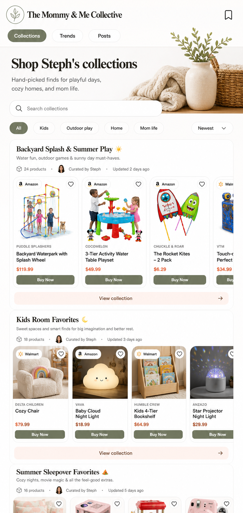

# Shop Collections

## Mockup

Layout contract: mobile canonical, desktop adaptive. Validate the 390px phone layout first; wider layouts may expand spacing and columns but must preserve the mobile hierarchy.

## Screen Role

This is the public landing page for Steph's curated collections. It should make collections feel like editorial shopping shelves rather than generic cards or database rows.

## Locked Edits

- Add a search bar for collections.
- Add category filters such as `All`, `Kids`, `Outdoor play`, `Home`, and `Mom life`.
- Keep a collection sort/filter control near the category filters.
- Display each collection as a titled shelf with a short creator note, collection metadata, and a horizontal product rail.
- Show public product cards with retailer identity, bookmark affordance, price, and `Buy Now`.
- Give each collection shelf exactly one collection-level action: `View collection`.

## Remove Or Avoid

- Do not keep both `View collection` and `Shop picks` on the same shelf. They read as duplicate collection actions.
- Do not make collection discovery feel like a grid of undifferentiated text cards.
- Do not replace the rails with stacked product lists on mobile.

## Design Notes

The rail is the selling pattern. A shopper should understand the collection theme from the heading and note, then immediately see enough products peeking sideways to want to swipe.
