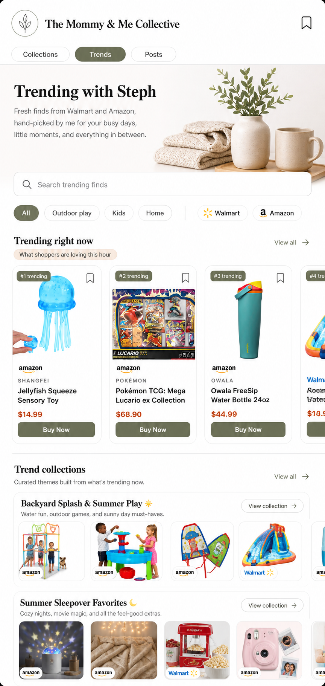

# Shop Trends

## Mockup

## Screen Role

This public page turns trend data into an audience-friendly shopping surface. It needs to separate high-momentum individual products from creator-friendly themed collections built from trends.

## Locked Edits

- Keep a search bar at the top of the trend results area.
- Use category and retailer filters instead of a `Choose how you shop` mode chooser.
- Present `Trending right now` as a premium horizontal rail of individual products.
- Keep `View all` on the top-product shelf so shoppers can open the full product trend list.
- Present `Trend collections` below as themed shelves with a collection title, short context line, product rail, and `View collection`.
- Keep public product CTAs as `Buy Now`.

## Remove Or Avoid

- Remove `Choose how you shop`.
- Do not make the top-product rail look like an odd unthemed collection.
- Do not use generic AI tag colors or low-design chip clutter.

## Design Notes

The top rail answers "what is hot right now?" The lower shelves answer "what does this creator recommend doing with those trends?" Those are different audience jobs and should look distinct.
