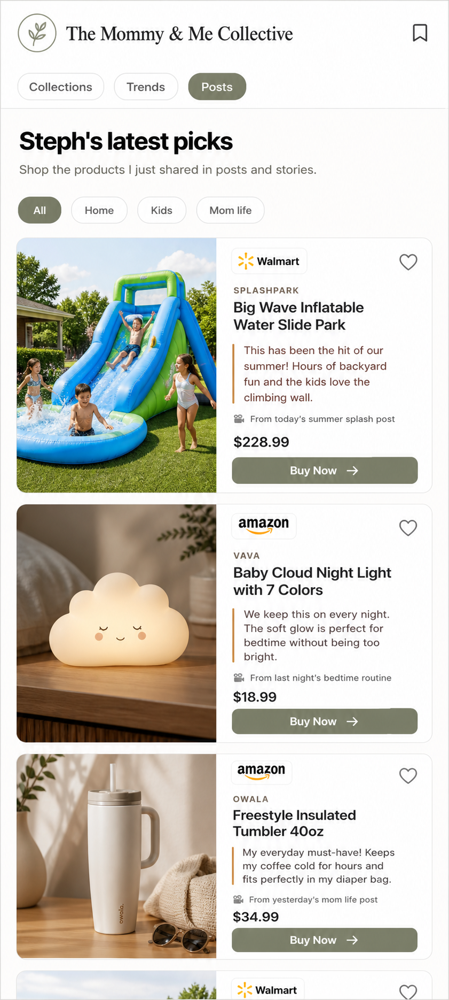

# Shop Posts

## Mockup

## Screen Role

This public page is a creator recommendation feed. It should feel closer to shopping Steph's shared picks than browsing a standard ecommerce catalog.

## Locked Edits

- Use vertical recommendation cards with strong product or lifestyle imagery.
- Keep the creator voice visible in each recommendation.
- Show refined retailer badges, bookmark affordances, and product price.
- Use `Buy Now` on public CTAs.
- Keep category filters light and editorial.

## Remove Or Avoid

- Do not add a cart-first header or product-grid framing that reads like a marketplace.
- Do not bury the creator note under raw product metadata.
- Do not replace the imagery with text-heavy post rows.

## Design Notes

Each card should make the product, Steph's reason for recommending it, and the next action obvious in one scan.
