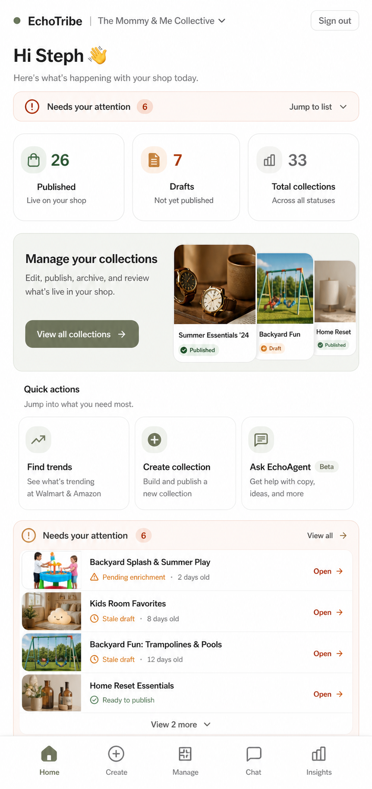

# Admin Hub

## Mockup

## Screen Role

This is the Creator Workspace home screen. It keeps the selected V1-B urgency-first intent while using the more polished admin system from Admin Manage.

## Locked Edits

- Use the Admin Manage shell language for header, bottom navigation, control styling, and card rhythm.
- Show a compact `Needs your attention` jump bar near the top.
- Keep snapshot metrics near the top for published collections, drafts, and total collections.
- Keep a strong visual entry into collection management.
- Keep quick actions visible for trends, create, and EchoAgent/chat.
- Move the detailed `Needs your attention` list lower on the page.

## Remove Or Avoid

- Do not let the full attention list dominate the first viewport.
- Do not revert to a tan-heavy old hub surface.
- Do not make the dashboard look disconnected from Manage, Create, and Trends Workspace.

## Design Notes

The top of the hub should orient Steph fast. The lower attention list is still important, but the jump bar lets urgency stay discoverable without making the home screen feel like an alert queue.
