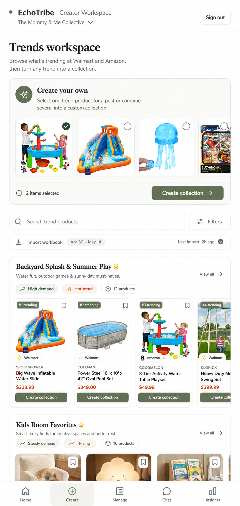

# Admin Trends Workspace

## Mockup

Layout contract: mobile canonical, desktop adaptive. Validate the 390px phone layout first; wider layouts may expand spacing and columns but must preserve the mobile hierarchy.

## Screen Role

This is the creator's visual trend workspace. It helps Steph browse trend products and turn selected products into a custom collection.

## Locked Edits

- Use the Admin Manage shell language, including the same bottom navigation family.
- Label the top creation module `Create your own`.
- Explain that one trend product can become an individual recommendation later and several products can become a custom collection.
- Show selection state visually on products in the create module.
- Keep only the main `Create collection` action in this mockup.
- Keep search, filters, and workbook/import state present but secondary.
- Show themed trend sections as visual work objects with product imagery and useful context.

## Remove Or Avoid

- Remove `Create from trends` from the top module.
- Remove the duplicate `Draft post` action from this screen.
- Do not turn trend sections into code-like rows or dense operational tables.

## Design Notes

This screen is already inside trends. The create module should feel like a tool for combining what Steph is seeing into her own collection, not a second route announcement.
