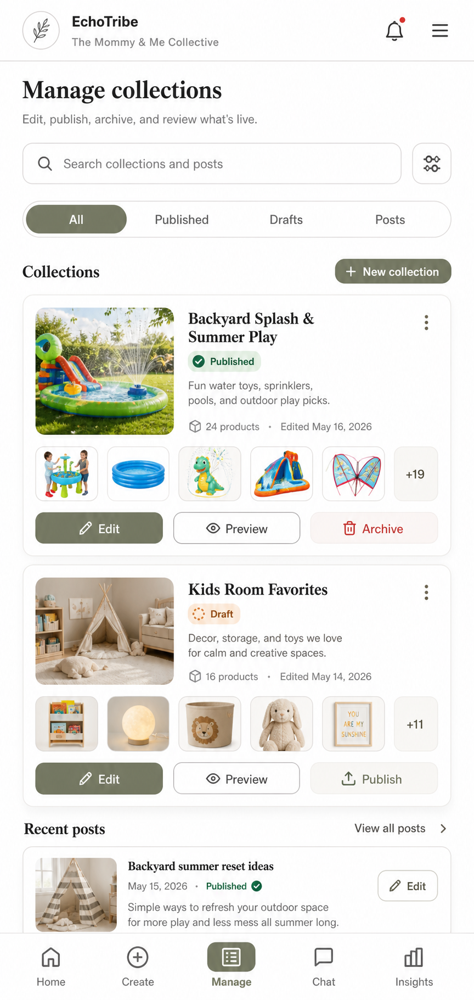

# Admin Manage

## Mockup

Layout contract: mobile canonical, desktop adaptive. Validate the 390px phone layout first; wider layouts may expand spacing and columns but must preserve the mobile hierarchy.

## Screen Role

This is the approved admin template reference. It is the strongest current example of how the Creator Workspace should look and behave across the management pages.

## Locked Edits

- Use a visual collection management surface instead of code-like text rows.
- Show collection cover imagery and product peeks before long metadata.
- Keep search and filter controls useful and compact.
- Show status badges, title, product count, edit timing, and publish state in a scannable hierarchy.
- Keep clear actions for `Edit`, `Preview`, `Archive`, and publish where relevant.
- Include recent posts without letting them overwhelm collection management.

## Remove Or Avoid

- Do not revert to mono-looking labels, stacked metadata labels, and near-empty text tables.
- Do not make each admin page invent a new header or footer style.
- Do not rely on color alone for status.

## Design Notes

Use this screen as the admin style anchor for Hub, Trends Workspace, Create, and EchoAgent. Collections should be recognizable at a glance before the user reads details.
