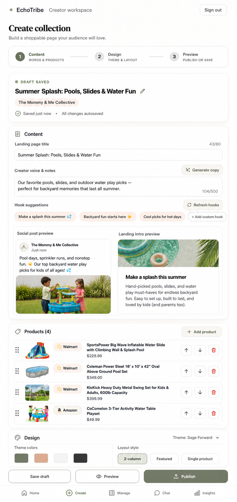

# Admin Create

## Mockup

Layout contract: mobile canonical, desktop adaptive. Validate the 390px phone layout first; wider layouts may expand spacing and columns but must preserve the mobile hierarchy.

## Screen Role

This is the collection editor and publishing workflow. It keeps the selected Content / Design / Preview structure while making the page feel more visual and less like a long form dump.

## Locked Edits

- Use the Admin Manage shell language.
- In the top header, keep only the workspace identity and `Sign out`; do not add the old top pill menu.
- Keep the three-step progress model: Content, Design, Preview.
- Show save or publish state clearly near the collection identity.
- Keep generation tools, creator voice, hook suggestions, social preview, landing intro preview, and product editing visible in the content step.
- Use visual product rows with images and compact reorder controls.
- In Layout Style, use exactly `2-column`, `Featured`, and `Single product`.
- Keep draft, preview, and publish actions clear at the bottom.

## Remove Or Avoid

- Do not use `3-column` as a layout option in this handoff.
- Do not bring back the extra top navigation that competes with the editor workflow.
- Do not let text fields become a wall of unstructured copy.

## Design Notes

This mockup should guide the editor toward a calmer workflow: collection identity first, content generation and previews together, products as visual objects, then design controls.
