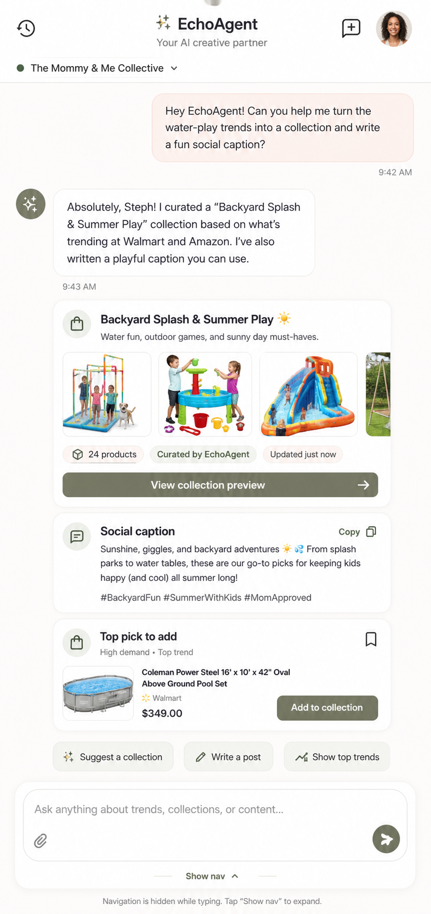

# EchoAgent Chat

## Mockup

## Screen Role

This is the AI collaborator surface inside the Creator Workspace. It should help Steph turn trends into collections and content without leaving the connected admin system.

## Locked Edits

- Follow the selected EchoAgent Variant B behavior.
- Keep the composer as the active focus surface.
- Collapse bottom navigation while typing and expose a small `Show nav` control to restore it.
- Let AI outputs include useful visual work objects such as a collection preview, caption block, and suggested product.
- Keep one-screen chat clarity with refined cards and actions rather than a noisy dashboard.

## Remove Or Avoid

- Do not ship two competing EchoAgent layouts in this handoff.
- Do not make the assistant output read like plain transcript text when it is generating collections or picks.
- Do not let navigation fight the composer while the user is writing.

## Design Notes

The most important behavior is focus. When Steph is prompting, the screen should give room to the composer and the generated work while still keeping the wider workspace recoverable.
